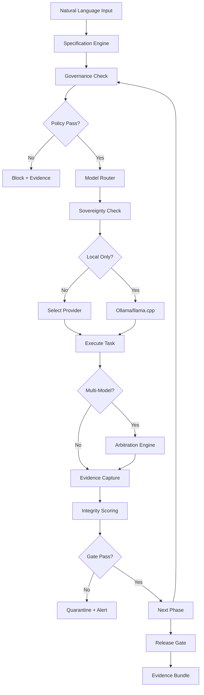
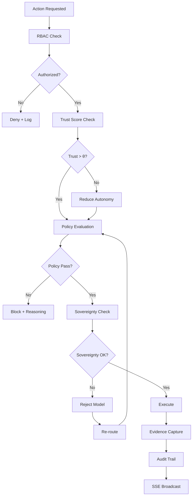
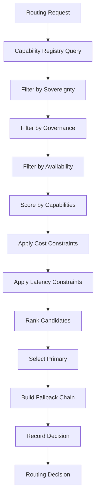
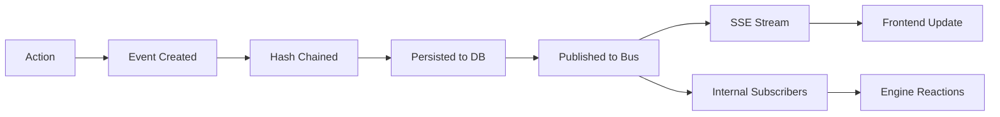
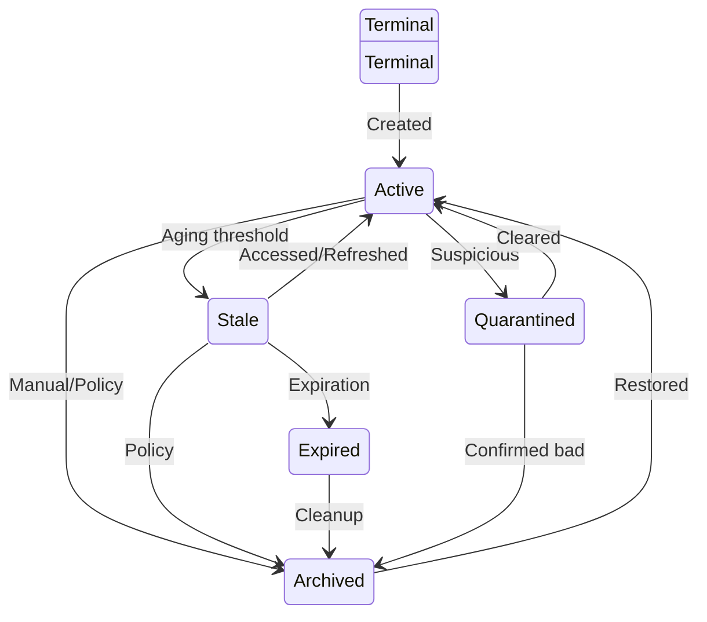
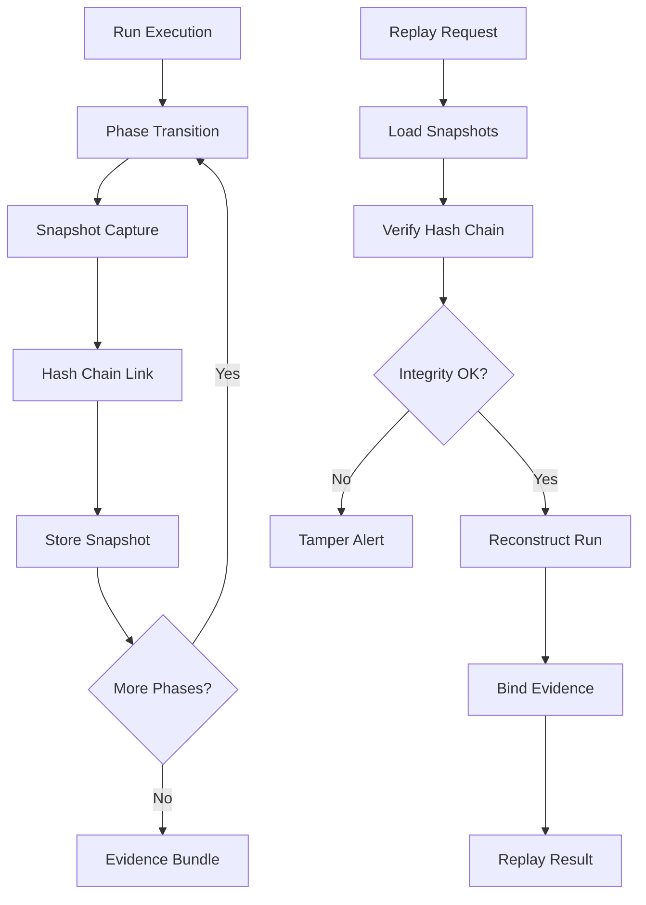
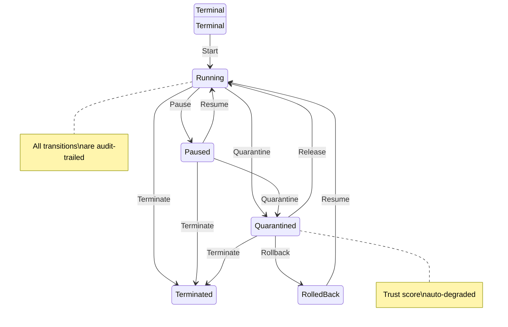
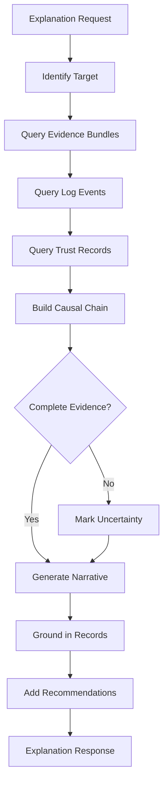
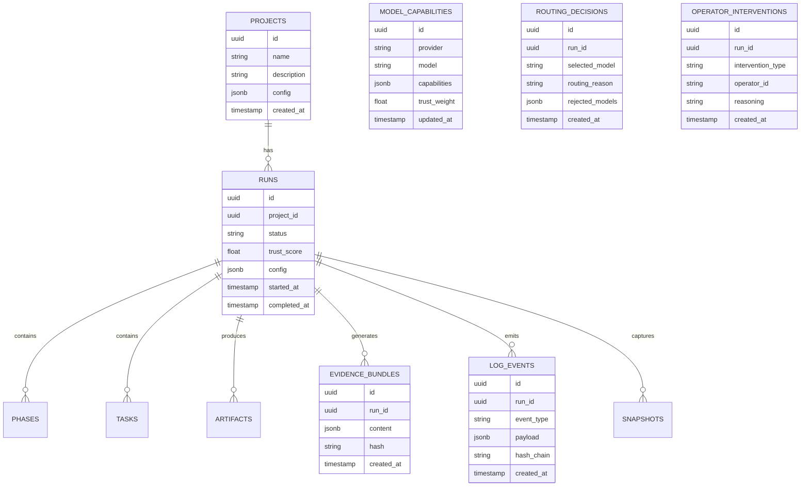

# Architecture Overview

## System Architecture

The Governed Autonomous SDLC Factory follows a layered architecture with clear separation of concerns:

```
┌─────────────────────────────────────────────────────────────────────┐
│                        CLIENT LAYER                                  │
│  ┌───────────────────────────────────────────────────────────────┐  │
│  │  Next.js 14 Frontend (Forge Control Tower)                    │  │
│  │  ┌─────────────┐ ┌──────────────┐ ┌────────────────────┐    │  │
│  │  │ 35+ Room    │ │ Shared UI    │ │ Client Libraries   │    │  │
│  │  │ Components  │ │ Components   │ │ (API, WS, Auth)    │    │  │
│  │  └─────────────┘ └──────────────┘ └────────────────────┘    │  │
│  └───────────────────────────────────────────────────────────────┘  │
└──────────────────────────────┬──────────────────────────────────────┘
                               │ HTTP / SSE / WebSocket
┌──────────────────────────────▼──────────────────────────────────────┐
│                        API LAYER                                     │
│  ┌───────────────────────────────────────────────────────────────┐  │
│  │  FastAPI Application                                           │  │
│  │  ┌─────────────┐ ┌──────────────┐ ┌────────────────────┐    │  │
│  │  │ 27+ REST    │ │ SSE Streams  │ │ Middleware Stack    │    │  │
│  │  │ Endpoints   │ │ (Telemetry)  │ │ (Auth, Audit, Trace)│    │  │
│  │  └─────────────┘ └──────────────┘ └────────────────────┘    │  │
│  └───────────────────────────────────────────────────────────────┘  │
└──────────────────────────────┬──────────────────────────────────────┘
                               │
┌──────────────────────────────▼──────────────────────────────────────┐
│                     SERVICE LAYER                                    │
│  ┌──────────────┐ ┌──────────────┐ ┌──────────────────────────┐   │
│  │ Full Pipeline │ │ Run          │ │ Project                  │   │
│  │ Orchestrator  │ │ Orchestrator │ │ Service                  │   │
│  └──────────────┘ └──────────────┘ └──────────────────────────┘   │
└──────────────────────────────┬──────────────────────────────────────┘
                               │
┌──────────────────────────────▼──────────────────────────────────────┐
│                      ENGINE LAYER                                    │
│  ┌──────────────────────────────────────────────────────────────┐   │
│  │  17+ Specialized Engines                                      │   │
│  │                                                               │   │
│  │  ┌─────────────────────┐  ┌─────────────────────────────┐   │   │
│  │  │ Cognitive Engines    │  │ Governance Engines           │   │   │
│  │  │ - Model Router       │  │ - Governance Engine          │   │   │
│  │  │ - Arbitration Engine │  │ - Drift Control Engine       │   │   │
│  │  │ - Cognitive Gov.     │  │ - Safety Guards              │   │   │
│  │  └─────────────────────┘  └─────────────────────────────┘   │   │
│  │  ┌─────────────────────┐  ┌─────────────────────────────┐   │   │
│  │  │ Execution Engines    │  │ Memory Engines               │   │   │
│  │  │ - Replay Engine      │  │ - Evidence Engine            │   │   │
│  │  │ - Semantic Coverage  │  │ - Traceability Engine        │   │   │
│  │  │ - Specification      │  │ - Inference Trace            │   │   │
│  │  │ - Architecture       │  │ - Source Extractor           │   │   │
│  │  │ - Test Engine        │  │ - Divergence Engine          │   │   │
│  │  └─────────────────────┘  └─────────────────────────────┘   │   │
│  └──────────────────────────────────────────────────────────────┘   │
└──────────────────────────────┬──────────────────────────────────────┘
                               │
┌──────────────────────────────▼──────────────────────────────────────┐
│                       CORE LAYER                                     │
│  ┌────────────┐ ┌────────────┐ ┌────────────┐ ┌────────────────┐  │
│  │ Auth       │ │ Config     │ │ Database   │ │ Observability  │  │
│  │ (JWT+RBAC) │ │ (Pydantic) │ │ (SQLAlchemy│ │ (OTel+Prom.)   │  │
│  └────────────┘ └────────────┘ └────────────┘ └────────────────┘  │
│  ┌────────────┐ ┌────────────┐ ┌────────────┐ ┌────────────────┐  │
│  │ Event Bus  │ │ Logging    │ │ Hashing    │ │ Safety Guards  │  │
│  │ (Pub/Sub)  │ │ (structlog)│ │ (SHA-256)  │ │ (11 types)     │  │
│  └────────────┘ └────────────┘ └────────────┘ └────────────────┘  │
└──────────────────────────────┬──────────────────────────────────────┘
                               │
┌──────────────────────────────▼──────────────────────────────────────┐
│                   INFRASTRUCTURE LAYER                               │
│  ┌────────────┐ ┌────────────┐ ┌────────────┐ ┌────────────────┐  │
│  │ PostgreSQL │ │ Redis      │ │ Qdrant     │ │ Ollama         │  │
│  │ (Primary)  │ │ (Cache)    │ │ (Vectors)  │ │ (Local Models) │  │
│  └────────────┘ └────────────┘ └────────────┘ └────────────────┘  │
└─────────────────────────────────────────────────────────────────────┘
```

## Runtime Execution Flow



## Governance Flow



## Model Routing Flow



## Event Lifecycle



## Memory Lifecycle



## Replay Architecture



## Intervention Lifecycle



## Explainability Pipeline



## Data Model Overview



## Component Dependency Map

```
Frontend (Next.js)
├── lib/api.ts → Backend REST API
├── lib/useWebSocket.ts → Backend WebSocket
├── lib/authStore.ts → /api/v1/auth/*
├── lib/data-source.ts → DataSourceBadge
├── components/rooms/* → lib/api.ts + lib/useWebSocket.ts
└── components/ui/* → Shared UI (no external deps)

Backend (FastAPI)
├── api/v1/endpoints/* → services/* + engines/*
├── services/* → engines/* + core/*
├── engines/* → core/* + models/*
├── core/database.py → PostgreSQL
├── core/event_bus.py → Internal pub/sub
├── core/observability.py → Prometheus
└── websocket/* → core/event_bus.py
```
